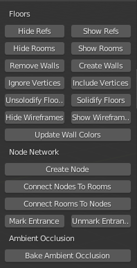

# Blender
Use [Blender 2.8](https://www.blender.org/) to open and edit the .blend files for the 3D floor plans.

## Using the Floorplan Addon
You can add the floorplan addon to Blender by going to Edit > Preferences > Add-ons > Install... and choosing the floorplan_addon.zip.
Next, enable the addon by searching for 'Import Floor Plan' in the search bar of the addon tab.

### 1. Converting PDF floorplans to json files
To run the script in this step you will need to have the [pdf2image python module](https://github.com/Belval/pdf2image) installed. Please follow the installation instructions for this module on its github page.

The first step for getting a floorplans into Blender is to extract the necessary data from the PDF files. This is done by running the `convertPdfs.py` script. This script will walk through all sub directories, and tries to extract floorplan data from any pdf it encounters. For every pdf the script will create a json and png file in the same directory.

The json file will contain all the data for the floorplan in this pdf. Including the building name, floor number, scale, and every room.
For every room the room code, label, and x and y coordinates are extracted.

The png file is a transparent version of the floorplan that can later be used as a reference image in Blender.

### 2. Importing the floorplan into Blender

To import the floorplan data into Blender go to `File > Import > HR Floor Plan`, and select the json file that was generated in step 1.

### 3. Creating the 3D model

At this point you will have to do quite a bit of manual labor to create the 3D model for each floor, and draw a node network for the building. The floorpanel tools panel can help with this.

*TODO: describe every function in the tools panel.*

### 4. Export the floorplan

After creating the complete 3D floorplan, it can be exported by going to `File > Export > HR Floor Plan`. This will create a json file, and a glb file.

The json file contains all the data of the node network: The nodes, and the connections between nodes. This json file can be used by the routing engine in the backend to calculate routes from one node to another.

The glb file is the 3D model of the floorplan that can be imported into Three.js. This file also includes the ambient occlusian maps.

## Floorplan Addon Development
The easiest way to write code for the floorplan addon is in [Visual Studio Code](https://code.visualstudio.com/) using the [Blender Development Extension](https://marketplace.visualstudio.com/items?itemName=JacquesLucke.blender-development). This extension allows you to easily reload Blender addons when changing code.
Additionaly you'll want to install the [bpy python module](https://pypi.org/project/bpy/) to resolve linting issues.
